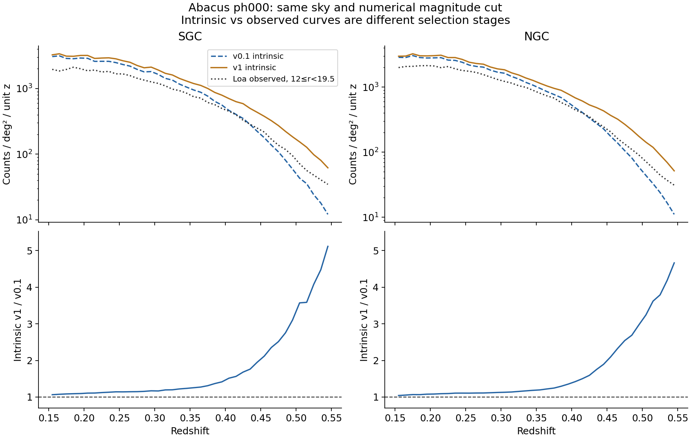
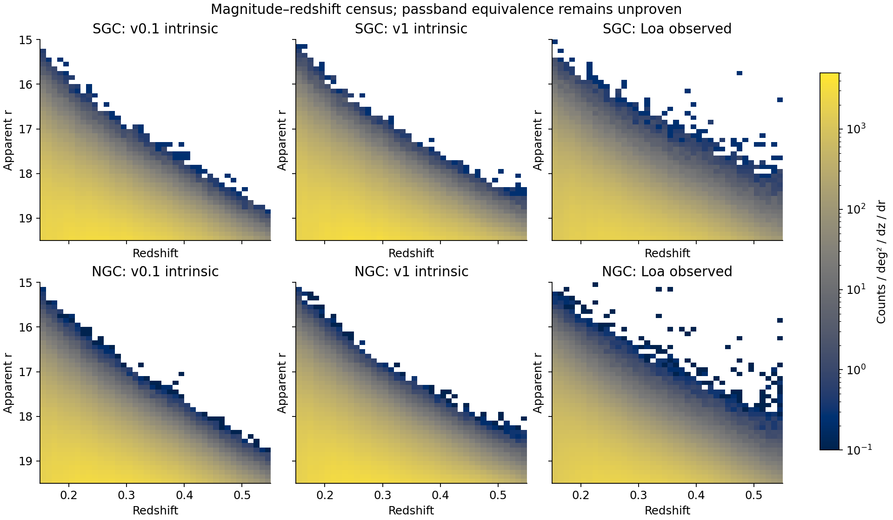
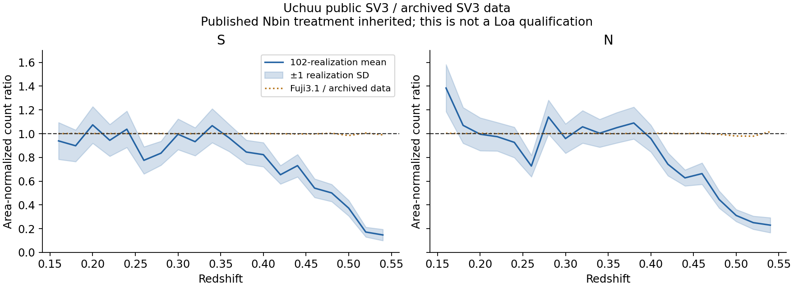
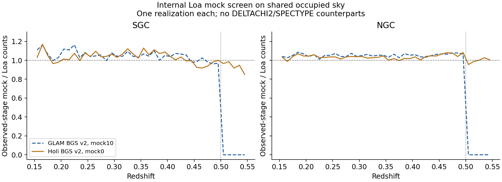
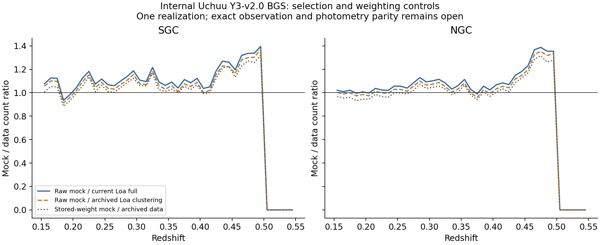

# Mock-to-Loa alignment: executed screens — 2026-09-26

The executed screens retain **Abacus v1 and internal Holi BGS v2 as useful
leads**, with different limitations. Public Uchuu SV3 has a high-z deficit;
newly located internal Uchuu Y3-v2.0 and GLAM products stop atz=.50 on the
comparison sky. None is a qualified full-range replacement. The provisional
VAC is unchanged.

CPU allocation58905757, nid004183. Reproducible scripts are under
`workflows/p12a_vac/alignment_*`; compact inputs/results are in
[evidence](evidence/p12a_alignment_execution_20260926/CONTRACT.json).
Only already-exposed Abacus ph000 was opened. GLAM mock10 and Holi mock0 are
new development screens, never independent confirmation. Uchuu102 SV3
realizations share a simulation volume; their scatter is not the precision
of102 independent full-Loa boxes.

## Abacus v1 changes the high-redshift population substantially

Both ph000 parents use the same occupied NSIDE256 sky, RSD redshift, numerical
12<=R_MAG_APP<19.5 cut and no IN_Y flag. Physical band/estimator equivalence is
not established. This comparison isolates a version difference, not a unique
cause or a matched observed selection.

| Redshift | Intrinsic v1/v0.1, SGC | Intrinsic v1/v0.1, NGC |
|---|---:|---:|
| 0.15–0.25 | 1.100 | 1.077 |
| 0.25–0.35 | 1.169 | 1.128 |
| 0.35–0.45 | 1.419 | 1.356 |
| 0.45–0.55 | 2.729 | 2.653 |

At .45–.55 the counts are79,509/174,317 in v1 versus29,139/65,707
in v0.1. Both parents sit above the observed Loa counts at low redshift;
observation losses have not been applied to these parents. A raw parent curve
crossing Loa is not agreement after assignment/spectral selection.

The old observer mapping is numerically identified for v0.1: colour RMS
4.26e-8mag, with apparent-r residual approximately-.8(z-.1). The same mapping
fails for v1: colour RMS0.0731mag and apparent-r RMS0.0408mag even after fitting
a linear residual. The fitted v1 residual slope must not be interpreted as its
LF Q parameter. **Reusing the old K/E recipe for v1 is a rejected route.**

The selected CEN=1 fraction also changes: SGC low shell0.862→0.679 and high
shell0.977→0.934 (NGC similar). Until flag semantics are pinned this is a column
comparison; even with identical semantics it is conditional on the selection,
not proof that only the HOD changed. No halo-by-halo matching was performed.

v1 has a different halo-ID/coordinate schema and only ph000 in the inspected
cut-sky directory. Its cubic directory has separate ph000_N/S catalogues with
220,424,052/220,411,276 rows. Header metadata does not pin its generator.
The directory's `latest.md` is a2024 storage inventory, not a recipe. The
current public author's `shared_code` remains a40a5d3; inspected finalize code
copies M/m fields and does not resolve the-.8 convention. No P/Q causal
conclusion or physical correction is justified yet.

## Public Uchuu SV3 does not establish full-Loa parity

Reproduced the authors' Figure2 comparison using archived
`edav1/sv3/LSScats/BGS_BRIGHT_[S/N]_nz.txt`: published Nbin per actual data area
versus raw mock counts per95.7deg2. All102x2 public files were read, r<=19.5;
no FKP weights. This avoids mixing different cosmological volume conventions.
The exact inherited data completeness weighting was not replayed because the
archived clustering rows were not located. Fuji3.1 n(z) gives a version control.
The [official VAC description](https://data.desi.lbl.gov/doc/releases/edr/vac/uchuu/)
pins the delivered geometry and column conventions. S/N below are the delivered
SV3 hemispheres, not an assumed conversion to our galactic-cap bins.

| Redshift | Uchuu/data S (mean ± realization SD) | Uchuu/data N |
|---|---:|---:|
| 0.15–0.25 | 0.973 ± 0.065 | 1.051 ± 0.069 |
| 0.25–0.35 | 0.890 ± 0.055 | 0.935 ± 0.057 |
| 0.35–0.45 | 0.834 ± 0.051 | 0.942 ± 0.064 |
| 0.45–0.55 | 0.423 ± 0.043 | 0.463 ± 0.042 |

This is a real numerical screen, not a formal goodness-of-fit p-value or a
statement that every Uchuu generation fails. The public SV3 product does not
supply an immediate high-z replacement. The paper's underlying
`JFE_files/DESI-BGS` path returns Permission denied. Snapshot parts in BGS220422
were not the required lightcone. Subsequent search found internal Y3-v2.0 BGS
parents and processed products elsewhere; see the dedicated test below. The
initial not-located statement was not evidence of absence.

## Internal Loa GLAM/Holi products located and screened

Pinned current LSS scripts explicitly name `glam_bgs_v2`, `survey=DA3`,
`surveycat=DA2`, and `specdata=loa-v1`. Following their transfer destination
located `/global/cfs/cdirs/desi/mocks/cai/LSS/DA2/mocks`, including readable
GLAM/Holi full BGS_BRIGHT HPmapcut products. **DA3 production naming here does
not mean the final product uses the matterhorn/DA3 footprint.**

The count screen intersects their occupied sky with the original common sky,
then recomputes actual Loa baseline counts there. GLAM/Holi initially missed
49/48 pixels of the original common mask. Pixel intersection remains weaker
than exact tile/veto/random parity. Mock successful selection is ZWARN0;
DELTACHI2/SPECTYPE and photometry are absent. No fake observables were assigned.

| Redshift | GLAM/Loa SGC | GLAM/Loa NGC | Holi/Loa SGC | Holi/Loa NGC |
|---|---:|---:|---:|---:|
| 0.15–0.25 | 1.085 | 1.049 | 1.034 | 1.038 |
| 0.25–0.35 | 1.046 | 1.053 | 1.058 | 1.033 |
| 0.35–0.45 | 1.051 | 1.048 | 1.066 | 1.018 |
| 0.45–0.55 | 0.737 | 0.795 | 0.944 | 1.049 |

GLAM has zero selected rows in every z=.50–.55 bin, in both caps. Its broad
high-shell deficit includes a support cutoff; it cannot be used for the full
VAC domain as delivered. Holi extends through.55, with5/40 SGC fine bins beyond
the provisional10% screen and0/40 NGC bins. One realization does not supply
cosmic-variance covariance; no formal statistical acceptance is claimed.

Current `prepare_holi_bgs.py` explicitly uses Loa input n(z) for ANY/BRIGHT,
random selection, and placeholder R_MAG_ABS values(-22/-21/-19). That is a
source-code observation, not proof of the exact executed holi_bgs_v2 recipe.
Close Holi counts could therefore be calibration input rather than independent
validation; placeholder magnitudes would not support a physical LF comparison.
Its `forFA0.fits` exists but lacks read permission(FITSIO104; confirmed file mode),
and GLAM's `forFA10.fits` was absent in the inspected root. This blocks the
parent/photometry replay on these specific paths. No permissions were changed.

## Decisions and gates

- Prioritize recovering the **v1 producer recipe**, exact passbands/K/E and
  halo/galaxy lineage before applying P/Q perturbations. The version already
  changes photometry and selected CEN mix substantially.
- Keep Holi as an **observation/count benchmark candidate**. Recover its readable
  parent and executed n(z) recipe, then assess clustering and galaxy–matter
  truth before considering it a training source.
- Retain public and internal Uchuu results separately. The newly located
  Y3-v2.0 BRIGHT, ANY and processed products all lackz>.50 on the comparison
  sky. Recover a deeper native lightcone and its recipe before claiming full
  Loa support. A magnitude cut cannot add missing parent galaxies.
- GLAM's tested delivered product cannot cover z>.50. Do not silently truncate
  the requested VAC range.
- W2/G2 is still open. W3 physical P/Q fitting, W4 ANY calibration and W5 new
  assignment are not launched across an unresolved magnitude convention.
  W6/W7 qualification and replacement VAC remain pending.

No email/Slack messages, catalogue repairs, new environmental labels, model
fits, retraining or VAC overwrite were performed.

## Internal matterhorn–Loa delivered-catalogue crosswalk

The current internal matterhorn-v2/v0 full catalogue was joined to Loa v2.1 by
TARGETID, retaining the original common sky and identical numerical science
quality rule. Both catalogues have unique TARGETIDs. Of10,631,484 total Loa
rows,10,629,391 occur in the11,686,801-row matterhorn catalogue. These are full
catalogue row counts, not galaxy science counts.

| Redshift | Matterhorn/Loa selected counts SGC | NGC |
|---|---:|---:|
| 0.15–0.25 | 1.222 | 1.159 |
| 0.25–0.35 | 1.217 | 1.153 |
| 0.35–0.45 | 1.207 | 1.144 |
| 0.45–0.55 | 1.193 | 1.134 |

Within matched IDs and common sky,7,232 formerly qualifying Loa rows no longer
pass the same science rule, while705,048 formerly nonqualifying rows now pass.
Of5,389,711 passing in both, none changes dereddened r by>0.01mag;8,221 change
the delivered Z column by |dz|/(1+z_Loa)>.005. Quality transitions include the
z-range requirement, not only spectral quality. Unmatched IDs can reflect
mask/catalogue construction as well as observations; do not call all new IDs
newly observed galaxies. Blinding status and detailed producer masks were not
independently certified, so this is a delivered-column audit, not a physical
evolution or cosmology measurement. The later catalogue does not reduce the
Loa tracer counts in this control; it is not an obvious remedy for a mock deficit.

## Further internal provenance found after the first screens

Following bounded producer directories located
`/global/cfs/cdirs/desi/mocks/cai/Uchuu-SHAM/Y3-v2.0/0000/`:
complete BGS BRIGHT12,407,294rows, ANY19,613,582rows, and processed
`altmtl/BGS_BRIGHT/BGS_BRIGHT_clustering.dat.h5`8,230,916rows. Parents contain
GALAXYID/PID, ABSMAG_R and rest colour. A paired archived real-Loa clustering
product exists in BGS-BRIGHT_data/v0.1. This corrects the earlier *not located*
status; its count screen completed separately from public SV3 (below). The directory
BGS-BRIGHT_data contains real data, not an additional mock variant.

The v1 cut-sky file is owned by jpiat.
`users/jpiat/abacus_mocks/cutsky/z0.200/AbacusSummit_base_c000` lists25 phase
directories with N/S products. Only ph000 was inspected; these producer files
are not yet proven identical to canonical v1, and listing a phase does not
open its payload or authorize new confirmation exposure.

## Internal Uchuu Y3-v2.0: apparent broad agreement hides missing support

Read both complete parents, the processed BGS clustering catalogue and its
paired archived real-Loa clustering catalogue. Recomputed raw and stored-WEIGHT
counts on an intersected occupied mask (paired data/mock miss9/75 pixels of
the initial mask). No WEIGHT_FKP and no newly fitted correction. A second
TARGETID crosswalk then recomputed our actual current Loa full-quality sample
on exactly that mask.

| Redshift | Raw processed Uchuu/current Loa SGC | NGC |
|---|---:|---:|
| 0.15–0.25 | 1.075 | 1.018 |
| 0.25–0.35 | 1.110 | 1.079 |
| 0.35–0.45 | 1.106 | 1.064 |
| 0.45–0.55 | 0.968 | 0.986 |

**The last row is not a successful tail match.** All three tested Uchuu products
(complete BRIGHT, complete ANY, processed BRIGHT) have zero selected rows in
every .50–.55 bin on this sky. The processed catalogue has39,907/93,635 rows
in.45–.50, compared with paired real Loa31,574/72,445; an excess below.50
cancels missing objects above.50 in the coarse sum. This is a concrete rejected
aggregate-count shortcut, now recorded in UCHUU_SUPPORT.json. The source
cutoff predates or is shared with the processed catalogue; assignment alone
cannot restore the missing range from these delivered parents.

Stored-weight high-shell ratios to paired data are0.919/0.934, versus raw
0.946/0.964. Neither removes the support cutoff. The paired archived real
clustering selection also differs from our full-quality sample: many paired
IDs fail current GALAXY/ZWARN or current-z-range requirements. Failure categories
overlap; their totals cannot be added. This changes the broad ratios by a few
percent and must not be confused with our original~1.8factor discrepancy.
The data-side comparison is now explicit, while mock-side cut/assignment
provenance remains unverified.

A4000-row systematic parent sample finds BGS_TYPE=BRIGHT/FAINT in ANY. PID
only takes-1/0 in this sample; **it must not be assumed to be a host-halo ID**.
GALAXYID is stored asfloat64 and is not yet joined to native halo IDs. The
z0.19 BGS box has54,069,989 rows with x/y/z, velocities andMr in a PyTables
block, but no explicit halo-ID column in that block. Particle and halo
directories are present (snapdir045, halodir045 withz0p19 names; particle file
names indicate samp0p005). Only directory/schema metadata was inspected, not
particle payloads or a validated matter-truth join. These assets make deeper
truth work plausible but do not establish the P12 cosmology/epoch estimand.

## Validation and operational closeout

Relevant3 mock-selection and1 flag-intersection unit tests pass. Census
invariants/source fingerprints and compact histogram hashes validate; parent
completed-run resume was checked without rescanning. FivePNG figures visually
reviewed; the Abacus ratio axis was corrected to show the whole high-z curve.
These are integrity checks, not scientific qualification. Compact histograms
and figures are explicitly committed despite repository binary-ignore rules.

Graphify update/global refresh succeeded in cosmic_env. A compute-node update
failed with flock errno524; the same conda tool succeeded on the login node.
An exploratory parent-schema min/max probe initially failed on string BGS_TYPE;
the corrected dtype-aware probe completed. The first allocation's idle shell
auto-loggedout after30min after completed scans; second allocation58907166
served the newly found internal Uchuu tests. No unrelated allocation altered.
