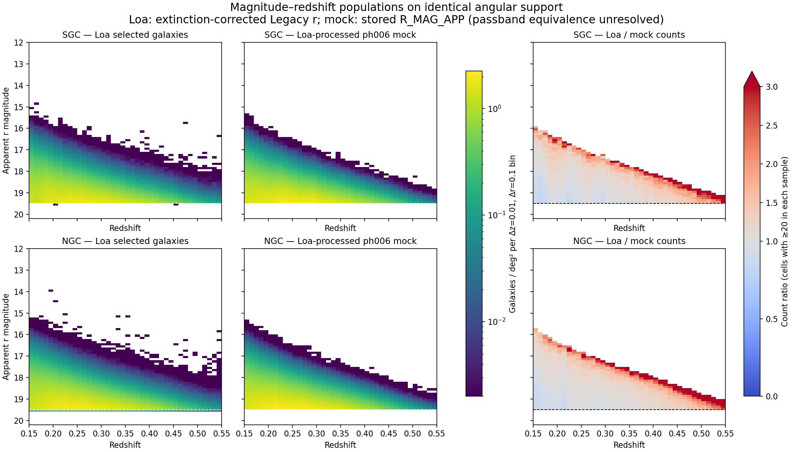
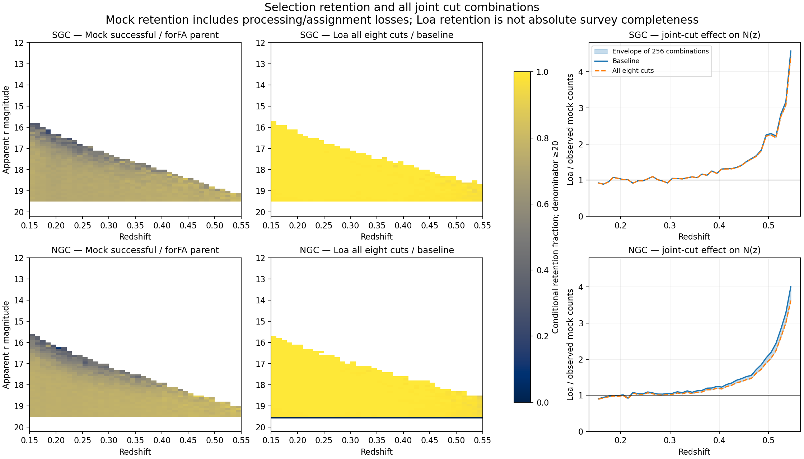

# Joint flag cuts and magnitude–redshift populations

Completed 2026-09-26 on CPU allocation 58903224. Diagnostic only: no production
selection change, refitting, retraining or replacement VAC.

## Joint-cut result

Scanned 5,397,649 Loa baseline galaxies on the fixed common NSIDE256 occupied-pixel
support. Baseline: 0.15 <= Z_not4clus < 0.55, ZWARN=0, SPECTYPE=GALAXY,
DELTACHI2>=25, from the Loa full_HPmapcut catalogue. Compared against the
Loa-processed, already exposed ph006 mock on exactly that support.

All 256 conjunctions of eight cuts were evaluated from joint row-level pass
patterns, not by adding individual rejection rates. They yield 12 distinct count
vectors. The union removes 100,573 rows (1.86%); summing individual failures would
incorrectly give 101,145 because exclusions overlap.

| Additional cut | Baseline rows failing it |
|---|---:|
| BGS_BRIGHT bit (BGS_TARGET & 2) | 0 |
| GOODHARDLOC | 0 |
| GOODPRI | 0 |
| LOCATION_ASSIGNED | 0 |
| COADD_FIBERSTATUS == 0 | 79 |
| DELTACHI2 > 40, retaining GALAXY | 13,175 |
| Uniform extinction-corrected apparent r < 19.5 | 87,884 |
| Nominal PHOTSYS 12 <= r < 19.54 north / 19.5 south | 7 |

Other table entries are already fixed: every baseline row passed the earlier
positive NOBS_G/R/Z census and the common-sky TSNR2_BGS>1000 check; ZWARN0 and
GALAXY define the baseline. Complete historical BRIGHT targeting, including
Gaia/SGA recovery, passed all science IDs. The seven nominal magnitude failures
are not evidence of invalid targets: the full targeting rule includes recovery.
IN_Y5 versus the DA2 footprint was separately tested in the ph006 replay, adding
only 77 SGC / 141 NGC high-shell objects on common sky; no stored IN_Y3 flag exists.
BRIGHT-02 would define a different absolute-magnitude sample and is not applied.
Thus this is exhaustive for the eight explicit toggles, not every imaginable
selection threshold or unresolved historical mask/observation recipe.

| Redshift | SGC baseline Loa/mock | SGC all cuts | NGC baseline Loa/mock | NGC all cuts |
|---|---:|---:|---:|---:|
| 0.15–0.25 | 0.977 | 0.976 | 0.985 | 0.969 |
| 0.25–0.35 | 1.029 | 1.027 | 1.066 | 1.037 |
| 0.35–0.45 | 1.210 | 1.206 | 1.221 | 1.170 |
| 0.45–0.55 | 1.856 | 1.832 | 1.839 | 1.718 |

In the highest broad shell, counts change 41,243 -> 40,697 SGC and
94,985 -> 88,719 NGC, versus mock 22,216 and 51,637. No tested conjunction
explains the high-redshift discrepancy. Uniform 19.5 changes the intended northern
sample; it is an alignment diagnostic, not an adopted repair.

## Magnitude–redshift diagrams

Counts use delta-z=0.01 and delta-r=0.1 bins, with the same density colour scale
and fixed area in each cap (4176.95 SGC / 9543.87 NGC deg² of occupied-pixel
support). No per-redshift normalization or count matching was applied. The dashed
reference is r=19.5; the dotted reference in the northern Loa panel is r=19.54
(the targeting threshold follows PHOTSYS, not Galactic cap). Ratio cells require
at least 20 galaxies in each sample; blank cells are not zero ratios.

Loa has a broader bright tail at fixed redshift than the mock. Its excess extends
above the faint magnitude boundary. This points to a parent luminosity/population
or photometric mapping difference, but does not establish whether the mechanism
is generator truncation, luminosity evolution, K-correction or photometry.
At 0.54–0.55, baseline ratios reach 4.58 SGC / 4.01 NGC; all cuts leave
4.44 / 3.62. Broad-shell averages therefore hide a sharper high-z divergence.

Loa uses 22.5 - 2.5 log10(FLUX_R/MW_TRANSMISSION_R); the mock uses stored
R_MAG_APP. Their passbands/estimators are not yet established equivalent.
A numerical r comparison is diagnostic, not proof of equivalent physical cuts.
No error bars/cosmic-variance estimate are supplied from this single exposed phase.

## Retention is not absolute Loa completeness

Every mock full-catalogue TARGETID was joined to the original forFA parent to
recover true RSDZ and R_MAG_APP, including unassigned targets. Mock observed/parent
retention, including processing/veto/assignment losses, rises from 0.719 to 0.745
SGC and 0.753 to 0.792 NGC across the four shells. It does not show a large
high-z retention collapse. This does not validate a realistic redshift-failure
model: mock DELTACHI2/SPECTYPE/fibre-status counterparts are absent.

Loa all-cuts/baseline is retention conditional on an already successful spectrum,
not survey completeness. True redshifts of missed/failed real targets are not
provided by this observed catalogue; absolute Loa completeness(z,r) cannot be
inferred from these plots alone. Matched occupied pixels also do not prove
identical subpixel angular coverage.

The 79 nonzero common-sky COADD_FIBERSTATUS values are all 8 = RESTRICTED
(restricted fibre reach) under installed desispec definitions. Current installed
validredshifts accepts RESTRICTED and VARIABLE. Exact historical Loa acceptance
revision still needs pinning; nonzero is not synonymous with invalid spectrum.

## Validation, provenance and next step

Baseline and mock per-z counts exactly reproduce PRODUCT_CROSSWALK.json; all
histogram Loa counts are retained within plotted magnitude bounds. Mock observed
counts are cellwise <= full <= parent. The synthetic intersection test passes.
Both figures were rendered and visually inspected. All 256 results, histogram
arrays, source paths/hashes, decoded fibre flags and PDFs accompany this report.
Run root: /pscratch/sd/d/dkololgi/graphweb_desi/outputs/p12a_flag_joint_20260926_v1.
Code: workflows/p12a_vac/flag_joint_magnitude.py and plot_flag_joint_magnitude.py.

Next: inspect the raw mock absolute-magnitude support and magnitude mapping at
fixed z, compare the same-galaxy photometric definitions, and establish a realistic
quality-success model before rerunning an accepted generation/assignment variant.
The joint-cut explanation has been bounded; upstream population and historical
mask/observation closure remain open. Keep the current VAC provisional.
