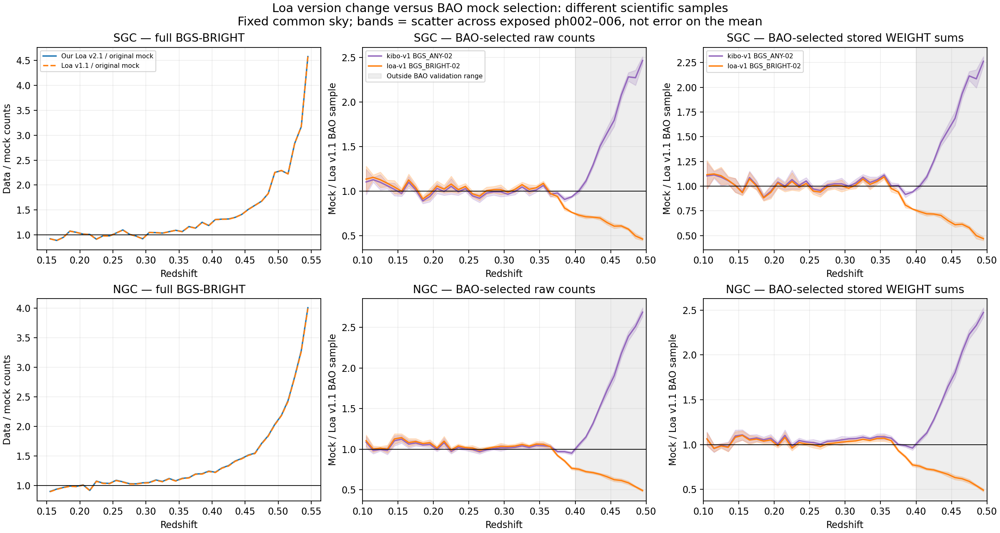

# Reference-mock literature and Loa v1.1 audit

2026-09-26. User requests independent verification of the linked summary and an
actual catalogue comparison. No training, production selection changes or repairs.

## What the linked sources establish

| Linked source | Verified interpretation |
|---|---|
| [2312.08792v2](https://arxiv.org/html/2312.08792v2), Smith et al., *Generating mock galaxy catalogues for flux-limited samples like the DESI Bright Galaxy Survey* | This is not the Moon paper named in the summary. It uses a z=0.2 Abacus box but explicitly remaps magnitudes to an evolving SDSS/GAMA luminosity function, with P=1.8 and Q=0.7, and assigns evolving colours and colour-dependent K-corrections. Positive Q brightens M-star with increasing z; positive P increases its normalization. The paper does not demonstrate that these values cause our measured factor-1.8 discrepancy. |
| [2507.01593v2](https://arxiv.org/html/2507.01593v2), Fernández-García et al., *DESI DR2 reference mocks: clustering results from Uchuu-BGS and LRG* | BGS uses a DESI-derived NGC luminosity function, SHAM, luminosity-dependent scatter, and shells assembled from discrete snapshots. Section 2.2 reports about 25% number-density disagreement above z=0.4; seamless high-z agreement is false. Section 5.1 gives about 10% BGS monopole differences over 1–20 Mpc/h, despite the broader abstract claim. Validation depends on statistic and sample; Table 1 ends BGS at z=0.5. Section 4.3 retains all targets in the footprint irrespective of completeness: this is not automatically an altMTL-observed catalogue. |
| [2007.14720v3](https://arxiv.org/html/2007.14720v3), Ishiyama et al., *The Uchuu Simulations: Data Release 1 and Dark Matter Halo Concentrations* | Confirms the 2 Gpc/h box, 2.1 trillion particles and released halo/particle products. Its power-spectrum cosmic-variance comparison uses 17 GLAM simulations, not a demonstrated catalogue of thousands of DESI-matched environmental training realizations. A single box does not provide independent large-volume initial conditions by rotation or reslicing. |
| [2608.27830v1](https://arxiv.org/html/2608.27830v1), Sanders et al., *A Unified Tracer Analysis of DESI DR2 Baryon Acoustic Oscillations* | Section II identifies v1.1 as the Loa LSS catalogue version. The unification concerns overlapping dark-time tracers. BGS remains the baseline sample at 0.1<z<0.4. This paper does not establish a newly named “v1.1 Unified Reference Mocks” BGS product qualified for our full flux-limited sample through z=0.55. |
| [APS DOI kdys-w8vl](https://journals.aps.org/prd/abstract/10.1103/kdys-w8vl), [2503.14742v3](https://arxiv.org/html/2503.14742v3), Andrade et al., *Validation of the DESI DR2 measurements of baryon acoustic oscillations from galaxies and quasars* | This is the actual source of the BGS_ANY workaround (Section III). For the revised absolute-magnitude-selected BGS sample, BRIGHT alone could not supply the required density above z=0.35. A redshift-dependent absolute-magnitude cut on ANY improves counts but leaves about 10% excessive clustering amplitude. BAO can marginalize that amplitude; environmental inference cannot assume it harmless. The BAO sample is Mr<-21.35 at 0.1<z<0.4, not our entire BRIGHT sample. |
| Generic ResearchGate/arXiv/APS home-page links | Opened, but they identify no paper or supporting passage. They cannot establish a specific production path, weighting scheme or selection equivalence. |

The [official Uchuu EDR VAC documentation](https://data.desi.lbl.gov/doc/releases/edr/vac/uchuu/)
identifies the 102 lightcones as copies of the **One-Percent Survey** footprint,
191.4 square degrees per realization, almost independent. They are not 102
independent full-Loa realizations. The published EDR column list also does not
supply host/subhalo IDs: SHAM ancestry in the generator does not guarantee that
a delivered catalogue preserves the joins needed for tidal-field truth.

## My interpretation of the discrepancy

The literature supports a **parent population and observer-photometry mismatch**
as a serious explanation. It does not isolate a single culprit in our execution.
In a flux-limited sample, larger distance selects increasingly rare bright
objects. Differences in the luminosity-function bright tail, its evolution,
colours or K-corrections can therefore be amplified with redshift. Our joint-cut
census and magnitude–redshift diagrams already show that standard extra quality
cuts cannot remove the excess, and that it extends into the bright tail.

A fixed dark-matter snapshot is a limitation for physical growth and evolving
halo occupation. It does not mathematically require a wrong n(z): luminosities
and selection can evolve on that snapshot. Conversely, a multi-snapshot lightcone
does not guarantee the right tracer population or photometry.

Weights are estimator-specific. Random-catalogue or PIP weighting is not inherently
improper, and cannot be said generally to change the underlying physical bias.
But weights cannot manufacture missing galaxy positions or validate the
conditional galaxy–matter relation needed by our encoder. Matching marginal
n(z) is necessary, not sufficient. A physically supported change to the mock
selection requires renewed response fields, encoder/domain checks and posterior
validation before replacing the provisional VAC.

## Catalogue identification and execution

Data: `/global/cfs/cdirs/desi/survey/catalogs/DA2/LSS/loa-v1/LSScats/v1.1/`.
Our production inputs remain the **v2.1 full BGS_BRIGHT** file.

Exposed reference phases: ph002–006, no truth or reserved phases inspected.
Root: `/global/cfs/cdirs/desi/survey/catalogs/DA2/mocks/SecondGenMocks/AbacusSummitBGS_v2/`.
Compared separate products:

- `altmtl{p}/kibo-v1/mock{p}/LSScats/BGS_ANY-02_{SGC,NGC}_clustering.dat.fits`;
- `altmtl{p}/loa-v1/mock{p}/LSScats/BGS_BRIGHT-02_{SGC,NGC}_clustering.dat.h5`;
- Loa v1.1 `nonKP/BGS_BRIGHT-21.35_{SGC,NGC}_clustering.dat.fits`.

The archived current LSS script has a redshift-dependent '-02' branch using
external polynomial tables and a +0.078 magnitude term. That establishes code
capability, not the execution provenance of every stored file. Do not infer
BGS_ANY ancestry from the '-02' suffix alone; inspect the target bits as well.

Bounded Uchuu inventory: `survey/catalogs/DA2/mocks/Uchuu-SHAM_Y3/mock0` contains
LRG products. `/global/cfs/cdirs/desi/mocks/Uchuu/DA2/kibo-v1/v0.1pip/` is empty.
Other Uchuu snapshot directories exist; SKIES_AND_UNIVERSE is permission-denied.
No readable full-Loa Uchuu BGS reference product was identified in these searched
locations. This is not a claim of nonexistence elsewhere, and no new Uchuu count
comparison is claimed.

Census code: `workflows/p12a_vac/reference_mock_check.py`, committed before run.
Job58904195, cosmic_env. Fixed common occupied-pixel support from prior ph006
comparison. Full-BRIGHT version check retains ZWARN0, DELTACHI2>=25 and GALAXY.
BAO comparisons use stored selections; raw counts and stored WEIGHT sums remain
separate. Five-phase scatter is descriptive and cannot support a well-estimated
50-bin covariance, a precision p-value, or an independent confirmation claim.

## Completed catalogue results

**No tested product is established as a statistical replacement for our full
Loa BGS-BRIGHT sample over 0.15–0.55.** Changing the Loa data version does not
resolve the discrepancy. The adjusted BAO selections behave differently and
must remain separate.

### Full BRIGHT: a data-version change is not the fix

| z range | v1.1 / v2.1 data, SGC | v1.1 / v2.1 data, NGC | v1.1 / original ph006 mock, SGC | v1.1 / original ph006 mock, NGC |
|---|---:|---:|---:|---:|
| 0.15–0.25 | 0.99764 | 0.99550 | 0.97503 | 0.98105 |
| 0.25–0.35 | 0.99826 | 0.99543 | 1.02716 | 1.06141 |
| 0.35–0.45 | 0.99777 | 0.99579 | 1.20741 | 1.21593 |
| 0.45–0.55 | 0.99896 | 0.99596 | 1.85452 | 1.83204 |

High-shell v1.1 data have 41,200 / 94,601 SGC/NGC successes, versus original
mock 22,216 / 51,637. All comparisons use the fixed common sky and identical
quality25+GALAXY selection for full BRIGHT.

### BAO-selected counts: aggregate agreement below 0.4 does not extend upward

These are **mock/data**, unlike the preceding full-BRIGHT data/mock column.
Mean +/- sample standard deviation across ph002–006; not standard error or a
formal goodness-of-fit p-value. Denominator is the stored Loa v1.1
BGS_BRIGHT-21.35 clustering sample.

| Mock product | SGC 0.1–0.4 | NGC 0.1–0.4 | SGC 0.4–0.5 | NGC 0.4–0.5 |
|---|---:|---:|---:|---:|
| Kibo BGS_ANY-02 | 0.9897 +/- 0.0053 | 1.0130 +/- 0.0032 | 1.5161 +/- 0.0171 | 1.5790 +/- 0.0160 |
| Loa BGS_BRIGHT-02 | 0.9903 +/- 0.0052 | 1.0053 +/- 0.0032 | 0.6635 +/- 0.0055 | 0.6758 +/- 0.0086 |

Using stored WEIGHT sums instead gives, in SGC/NGC order:
ANY 1.0127/1.0418 below0.4 and1.4447/1.5081 at0.4–0.5;
BRIGHT 0.9794/1.0021 below0.4 and0.6698/0.6821 at0.4–0.5.
These do not convert either product into the missing full-BRIGHT population.
Stored weights can have different normalization/provenance, so this is a
sensitivity comparison, not an independent selection correction.

Fine delta-z=0.01 mock-mean/data ratios below0.4 still range0.891–1.128 SGC and
0.950–1.123 NGC for ANY; BRIGHT ranges0.763–1.155 and0.764–1.142.
Percent-level integrated agreement is not pointwise equality or proof of
statistical equivalence. No new two-point clustering was measured; the published
BAO amplitude limitation remains relevant.

The delivered v1.1 BAO clustering file has no entries at z>=0.5. We therefore
mask zero-denominator cells and stop the BAO ratio panels at0.5; the full-BRIGHT
comparison continues to0.55. An initial plotting pass divided by a placeholder
one in empty bins; that was corrected before delivery, and the final JSON uses
null for undefined ratios. Catalogue counts were unaffected.

### The '-02' products are materially different populations

ph006 Kibo ANY successful common-sky rows have BGS_TARGET values1(358,355),
2(1,424,252) and9(124,852). Values1/9 lack BRIGHT bit2: the product genuinely
includes non-BRIGHT targets. In contrast, all1,481,399 corresponding successful
Loa BRIGHT-02 rows have value2. These totals span the stored catalogue rather
than just the BAO validation range. In0.4–0.5, Kibo ANY contains315,362
non-BRIGHT and231,517 BRIGHT objects across both caps. This is a selected mixture,
not a photometrically identical reprocessing of the original BRIGHT catalogue.

## Decision and next checks

1. Keep the provisional VAC and its production selection unchanged. Do not switch
   blindly to a supposed v1.1 mock release or use the BAO mixture as environmental
   training without rebuilding and validating its observation/galaxy–matter model.
2. Treat the documented ANY workaround as independent evidence that the available
   BRIGHT parent can be insufficient, not as identification of our generator bug.
   Close the executed magnitude/LF/K-correction recipe and compare DESI-derived
   luminosity functions and observer-band transformations on the exposed phase.
3. Use a forward-model revision that preserves halo/particle provenance, then test
   joint z–magnitude–colour distributions, small-scale clustering and environmental
   posterior calibration. Freeze a candidate before independent confirmation.
4. Uchuu remains a useful possible external check, with new cosmology, snapshot,
   coordinate and tidal-truth joins to establish. The sources do not justify
   replacing Abacus solely because Uchuu uses multiple snapshots.

Evidence: COMPLETE.json, SUMMARY.json, VALIDATION.json and standalone PNG/PDF in
`docs/evidence/p12a_reference_mocks_20260926/`. Run logs remain at
`/pscratch/sd/d/dkololgi/graphweb_desi/outputs/p12a_reference_mocks_20260926_v1/`.
